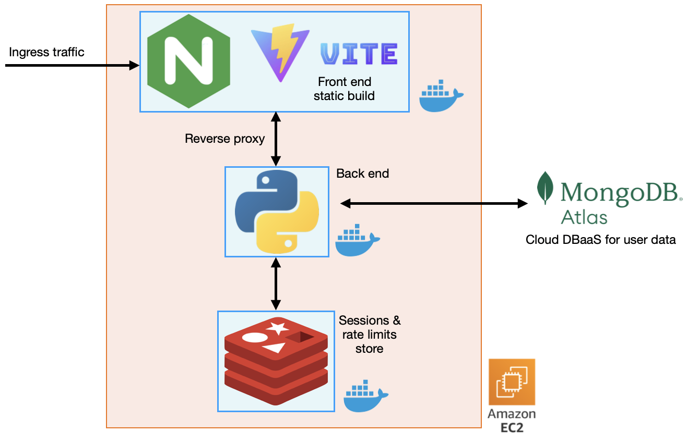

# Operations repository for First balance

## Table of contents
- [Project description](#project-description)
  - [Tech stack](#tech-stack)
- [About this repository](#about-this-repository)
  - [Folder structure](#folder-structure)
  - [Future improvements](#future-improvements)

## Project description
First balance ([firstbalance.net](https://firstbalance.net)) is my little personal project, a web application for managing personal finance records. 

- Sign in with Google
- Dashboard summarizing overall statistics
- Create/Read/Update/Delete records with an editable table

The project is mainly a learning sandbox for me, and is still in development. More features and improvements are to come.

### Tech stack
Front end
- React.js with TypeScript
- Zod (data validation)
- React context and Zustand (state management)
- Vite (local dev server + bundler)

Back end
- Python Flask (API framework)
- Pydantic (data modeling and validation)
- Redis (rate limits and sessions store)
- MongoDB Atlas (user data store)

Infrastructure
- Docker, Docker Compose, Docker Hub image registry
- AWS EC2
- NGINX (reverse proxy + TLS termination)
- Cloudflare (DNS)

CI/CD pipelines
- GitHub Actions
- PyCQA's Bandit (Python SAST)
- CodeQL (SAST)


## About this repository
This repository contains the deployment configuration and infrastructure files required to run the project in both development and production environments.

***You can check out the front end repository of this project [here](https://github.com/DawitSurithpinyo/first_balance_frontend) and back end [here](https://github.com/DawitSurithpinyo/first_balance_backend)***

This project currently uses a simple, single-host architecture:
- Docker compose to run all services inside an AWS EC2 instance.



- GitHub Actions for CI/CD to automatically test/build/deploy and calculate new semantic version after changes are made.
  - CI/CD pipelines for front end and back end are defined in their respective repository

### Folder structure
The `development` folder contains the development version of Docker compose (and other configs) for testing. 

Likewise, the `production` folder mimics the actual folder structure used inside the EC2 instance itself:
```
./production
├── compose.yml
├── .env
└── config
    ├── redis.conf
    └── ...
```
(Obviously, the `.env` file is ignored by Git)

### Future improvements
Planned improvements include:
- Monitoring
- Automation on infrastructure setups
- Additional deployment enhancements

However, the current focus is on completing the project's remaining features and user interface.